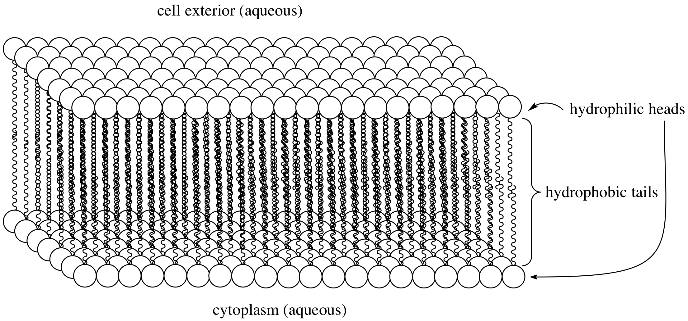

## But what is a neuron?
Think of a neuron as the fundamental unit of processing in our brains. Analogous to transistors in a microcontroller or a processing unit, neurons, when connected intelligently together, can form rather intricate circuits that perform logic and computation quickly and efficiently . Zooming in on these circuits, a neuron receives inputs and decides whether to pass them to other neurons or not. However, this process is not as straight forward as it might first sound; there is a multitude of intertwined variables at play that dictate this process on the single neuron level. Let's take a deeper look into what makes up a neuron.

## The anatomy of a neuron
A neuron, without loss of generality, is made up from a cell body connected to dendrites and an axon. Dendrites serve as the input site to the neuron and the axon is where the signal travels before it is outputed onto other neurons' dendrites. However, like other cells in our body, a neuron is made up from a membrane that contatins the organs of the neuron -or organelles- that perform the necessary function to keep the neuron alive. This membrane as we'll see plays a critical role in the neuron's ability to generate and conduct electrical signals. 

### The Membrane:
Cell membranes are known as a 'Phospholipid Bilayer'. As the name suggests, a patch of membrane is made up from lots of repeating molecules called 'Phospholipids' stacked next to one another. Each of these molecules contains a phosphate head and two fatty acid tails. For the membrane to be doing its job, it has to act as a barrier isolating the inside (intracellular space) of the cell from the outside (extracellular space). Both of these spaces contain lots of water. Now the phosphate head likes to be in contact with water and hence it is called 'hydrophilic', while the fatty acid tails are repelled from water and called 'hydrophobic'. Due to this dichotomous property, if we add these molecules to water, they will arrange themselves in such a way that 'protects' the tails from water, while exposing the head to water. One possible arrangement, as you can imagine, is for every two phospholipid molecules to align their fatty acid tails facing one another hiding them from water. This gives the rise to a bilayer sheet of phospholipids - or a phospholipid bilayer. 
 

  

 

Although it might not seem like it, but the molecules in this resulting structure -the membrane- are **very** tightly packed together, so no molecules or ions can pass through the membrane. Instead, there are channels that the cell produces and embeds within the membrane to act like a tunnel for ions to pass through in and out of the cell. The result therefore is a semi-permeable membrane -only permeable to select ions to pass- while blocking the passage of all other species. This is where all the magic starts!

## Nernst and the ionic tug of war
Consider a didactic square container divided in the middle by a similar semi-permeable membrane forming Compratment \\(A\\) and Compratment \\(B\\). Each compratment contains a solution containing different concentrations of molecule \\(X\\) and molecule \\(Y\\). Let there be more \\(X\\) in compartment \\(A\\) and more \\(Y\\) in compartment \\(B\\). In other words: \\([X]_A > [X]_B\\)  and \\([Y]_B > [Y]_A\\). If the membrane is permeable to \\(X\\), then \\(X\\) will flow from \\(A\\) to \\(B\\) along the concentration gradient until the concentration is equalized. 


 But what if \\(X\\) and \\(Y\\) have a charge? say \\(X^+\\) and \\(Y^+\\). Well now \\(X^+\\) will flow from \\(A\\) to \\(B\\) as before, but as more of it flow to \\(B\\), they experience a repelling force from all the other positive ions in \\(B\\). Moreover, now that \\(A\\) has less positive ions than \\(B\\), it is relatively negative to \\(B\\), meaning that \\(X^+\\) ions also experience an attractive force pulling them back to \\(A\\). Therefore there are two gradients at play here, diffusion gradient, and electrochemical gradient. When these two gradients are equal, the system is said to have reached equilibrium and the resulting potential difference between compartments \\(A\\) and \\(B\\) is called the *Equilibrium Potential*. At this state, the number of \\(X^+\\) leaving \\(A\\) due to the concentration gradient is equal to the number of \\(X^+\\) entering \\(A\\) due to the electrical gradient.
This quantity can be calculated by what is known as the Nernst equation: $$E = E_{\text{eq}} + \frac{RT}{zF} \ln\left(\frac{[C_{\text{in}}]}{[C_{\text{out}}]}\right)$$ 


You can probably tell that this is the beginning of some sort of an electrical signal, but how does this signal originate and propagate if we're always at the equilibrium potential? In one word: *Channels*

## Channels Channels Channels!
Well, more like three words: *voltage-sensitive channels*.